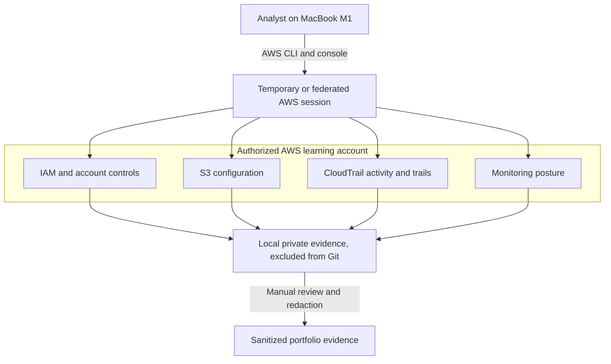

# Architecture Review

The assessment collects configuration evidence through an authorized identity. Raw output remains local. Only redacted summaries and screenshots enter the portfolio repository.
