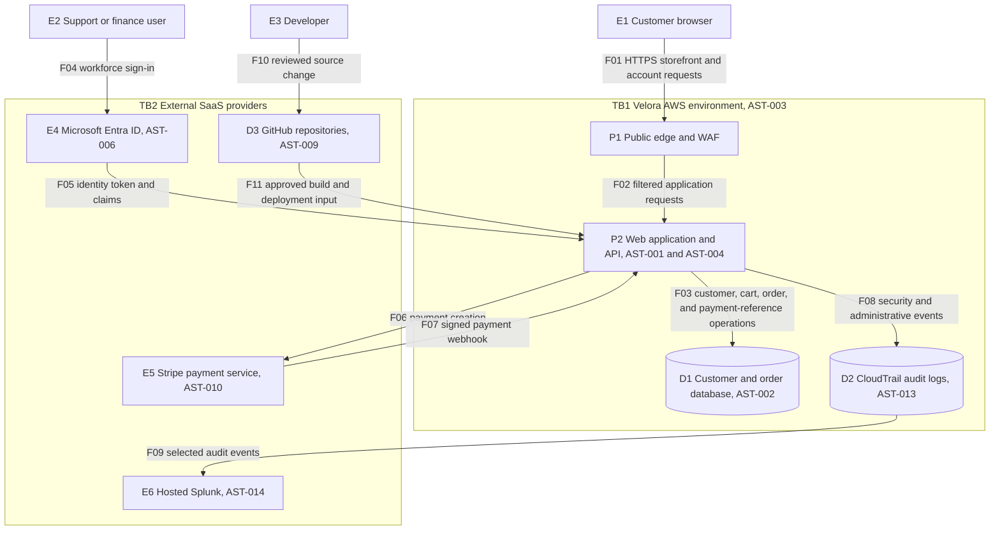

# Architectural Data-Flow Diagram Model

This section documents the structured data-flow diagram (DFD) layout for Velora's Customer Web Application. The system maps computational components, communication vectors, and data classifications across discrete organizational trust zones.

## 1. System Data-Flow Diagram (DFD)

## 2. Diagram Labels
*   **E** means external entity.
*   **P** means process.
*   **D** means data store.
*   **F** means data flow.
*   **TB** means trust boundary.

## 3. Model Status
*   **Version:** 1.0
*   **Review Date:** 2026-09-14
*   **Owner:** Engineering Lead, simulated
*   **Security Reviewer:** Cybersecurity Analyst, simulated
*   **Evidence Label:** Simulated architecture, tested for internal consistency

---

## 4. Diagram Review Questions & Structural Attestations

To confirm the internal data integrity and defensive capability of this design before running STRIDE threat calculations, the following eight verification checkpoints have been manually traced and validated:

1.  **Does every external input reach a process before a data store?**
    *   *Attestation:* Yes. External entities `E1`, `E2`, and `E3` never interact with data repositories directly. For example, public input `F01` from the customer browser hitting `E1` passes through public edge process `P1` and application logic process `P2` before updating database `D1`.
2.  **Is every trust-boundary crossing visible?**
    *   *Attestation:* Yes. Trust boundaries `TB1` (AWS Production Zone) and `TB2` (External SaaS Providers) are rendered clearly. Flows crossing between public space and these subgraphs (e.g., `F01`, `F04`, `F10`) represent visible crossing vectors.
3.  **Are authentication and authorization flows distinguishable?**
    *   *Attestation:* Yes. Employee authentication occurs over path `F04` directly via identity provider `E4`. Authorization claims and access tokens are subsequently packaged and transmitted to the application server core over flow path `F05` for enforcement.
4.  **Is payment initiation different from payment confirmation?**
    *   *Attestation:* Yes. Payment initiation is isolated to outbound flow `F06`, which passes transaction metadata to the processor (`E5`). Payment verification is handled asynchronously via the signed inbound webhook notification channel on flow path `F07`.
5.  **Can each priority data set be traced through the diagram?**
    *   *Attestation:* Yes. Customer and order information sets (`DAT-001`/`DAT-002`) pass through routing lines `F01`/`F02` and reside in database `D1` via path `F03`. Infrastructure deployment data (`DAT-004`) routes via `F10`/`F11`. Forensic trails (`DAT-006`) flow over paths `F08`/`F09`.
6.  **Are administrative and customer paths distinguishable?**
    *   *Attestation:* Yes. Customer browsing flows route via edge processes (`F01` $\rightarrow$ `P1` $\rightarrow$ `F02` $\rightarrow$ `P2`). Corporate management, support, and financial administration paths leverage identity providers and distinct service logic paths (`F04` $\rightarrow$ `E4` $\rightarrow$ `F05` $\rightarrow$ `P2`).
7.  **Is the logging destination shown?**
    *   *Attestation:* Yes. Local application events generate records within the CloudTrail logging store `D2` via flow `F08`. Highly sensitive security metrics are dynamically aggregated and shipped outwards across boundaries to the central SIEM node `E6` via flow path `F09`.
8.  **Is the source-to-deployment path represented?**
    *   *Attestation:* Yes. Engineers push code alterations to the remote repository system `D3` over path `F10`. Upon passing security checks, the automated build and release inputs are safely deployed downwards onto the application host environment over path `F11`.

