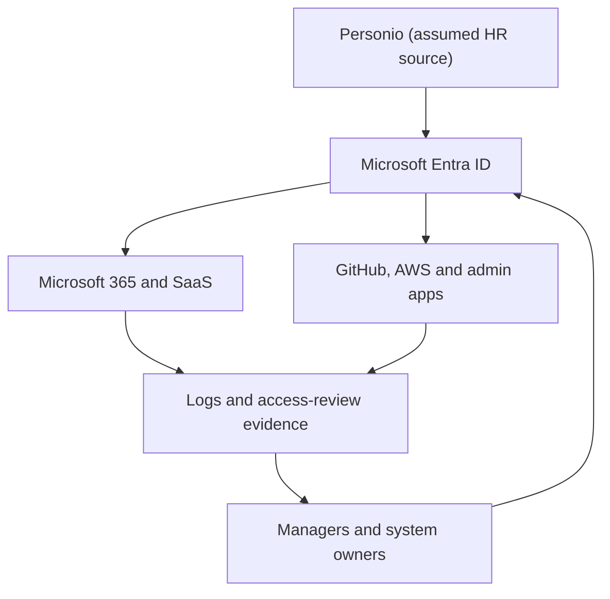

# Identity and Access Governance Architecture

This document maps the flow of identity data, authentication signals, and governance reviews across the Velora Commerce GmbH enterprise ecosystem.

## Architectural Component Roles and Audit Requirements

| Component | Operational Role | Compliance Evidence Needed |
| :--- | :--- | :--- |
| **Personio** | Starts joiner, mover, and leaver events as the authoritative HR core | Start date, end date, department, manager string, and employment status |
| **Entra ID** | Central workforce identity repository and enterprise authentication layer | Account status, assigned role, MFA enforcement, last sign-in timestamp, group and app assignments |
| **SaaS and technical systems** | Enforce application-specific permissions and business tool configurations | Application role exports, group entitlement lists, and system-owner approval logs |
| **Logs** | Show authorization, authentication, and administrative activity events | Interactive sign-in logs, tenant audit trails, access-review logs, and PIM privileged role-activation records |
| **Managers** | Confirm continued business need and validate subordinate profiles | Formally recorded Keep, Remove, Modify, or Escalate decision with explicit business reasoning |
| **System owners** | Approve privileged, sensitive, or exceptional system access packages | Signed approval records, hard-coded expiry dates, automated separation-of-duties conflict checks, and active exception records |

## Architectural Limitation
Personio-to-Entra automation is an assumed target architecture. The project does not prove that Velora has configured automated provisioning.

