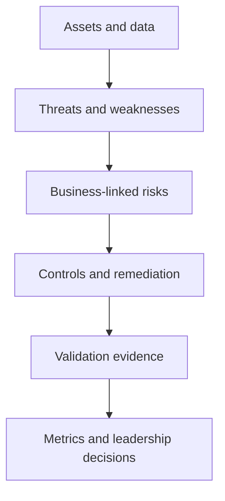

# Velora Commerce GmbH Security Program

> A security generalist portfolio demonstrating how technical evidence becomes business risk, control decisions, remediation, and measurable assurance.

## Executive summary

Velora Commerce GmbH is a fictional 60-person Berlin-based company that provides an e-commerce SaaS platform to small European retailers.

This repository documents an integrated cybersecurity program covering governance, risk, compliance, identity, vulnerability management, application security, cloud security, system hardening, recovery, and executive planning.

The projects are connected through shared assets, risks, findings, controls, owners, and evidence. They demonstrate my ability to work across security domains while communicating technical decisions clearly to engineering, IT, risk owners, and leadership.

## What this repository demonstrates

- Asset identification, data classification, risk assessment, and treatment planning
- Security-control evaluation using evidence and defined test criteria
- Identity governance, RBAC, joiner-mover-leaver controls, and access reviews
- Vulnerability discovery, validation, prioritization, remediation, and retesting
- Authorized web application security testing with Burp Suite
- Application threat modeling using STRIDE, abuse cases, and trust boundaries
- Secure SDLC requirements, verification tests, and release gates
- AWS IAM, S3, CloudTrail, monitoring, and remediation analysis
- Windows and Linux hardening with rollback and recovery validation
- Security metrics, threat briefings, tabletop exercises, and executive roadmaps

## Business scenario

Velora operates a customer-facing e-commerce platform and depends on:

- AWS infrastructure in `eu-central-1`
- Microsoft Entra ID and Microsoft 365
- Windows employee endpoints
- Ubuntu application servers
- GitHub source-code repositories
- Customer, order, authentication, and operational data
- Payment, support, analytics, HR, and other third-party services

The fictional company has a small IT team and no dedicated security department. The program therefore prioritizes practical controls, accountable ownership, measurable evidence, and risk-based sequencing.

## Security-program workflow



## Project portfolio

| Project | Security domain | What it demonstrates |
|---|---|---|
| [Security Program Risk Assessment](./Security-program-risk-assessment-project/) | GRC and risk management | Inventories critical assets and data, prioritizes business-linked risks, maps selected NIST CSF 2.0 outcomes, and builds a 90-day treatment plan |
| [Control, Compliance, Privacy and Vendor Review](./Control-and-compliance-vendor-review/) | GRC, privacy, audit, third-party risk | Evaluates control design and evidence, records findings, screens privacy risk, reviews vendor dependencies, and creates an accountable remediation plan |
| [Identity and Access Governance](./Identity-and-access-governance) | IAM | Models the identity lifecycle, defines RBAC and JML controls, reviews a risk-based identity sample, automates exception detection with PowerShell, and documents remediation decisions |
| [Vulnerability Management Lifecycle](./Vulnerability-management/) | Vulnerability management | Uses Nessus in an authorized Ubuntu ARM lab, validates findings, adds exploit and business context, manages remediation safely, and verifies closure through rescanning |
| [Web Application Penetration Test](./Web-app-Penetration-testing/) | Application security | Tests authorized PortSwigger labs with Burp Suite, documents injection, XSS, authorization, and authentication-control failures, and creates developer-ready remediation and retest criteria |
| [Application Threat Model and Secure SDLC](./Application-threat-model-and-secure-SDLC/) | Product and application security | Maps application flows and trust boundaries, applies STRIDE and abuse cases, prioritizes threats, and converts them into security requirements, tests, and release gates |
| [AWS Cloud Security Posture Review](./AWS-Cloud-security-posture-review/) | Cloud security | Reviews an authorized personal AWS learning account across IAM, S3, CloudTrail, monitoring, and cost safeguards, then defines safe remediation and retesting |
| [Windows and Linux Hardening with Recovery Validation](./system-hardening-recovery/) | System security and resilience | Establishes before-state baselines, applies selected role-aware controls, validates service availability and rollback readiness, and tests synthetic file recovery |
| [Integrated Security Generalist Capstone](./security-generalist-capstone/) | Security leadership | Consolidates evidence into a threat briefing, measurable dashboard, incident tabletop, awareness plan, and prioritized executive roadmap |

## Selected outcomes

| Area | Portfolio outcome |
|---|---|
| Program baseline | Documented 18 assets, 6 datasets, 10 business-linked risks, and 18 selected NIST CSF 2.0 outcomes |
| Control assurance | Evaluated 15 selected security, privacy, and vendor controls and converted gaps into owned corrective actions |
| Identity governance | Defined a 71-object identity population, reviewed a 25-identity risk-based sample, and used PowerShell to detect control exceptions |
| Web security | Reproduced four vulnerability classes in authorized training labs and documented evidence, impact, remediation, and retest criteria |
| Threat modeling | Connected 11 application flows to 12 threats, 12 measurable security requirements, and 12 verification tests |
| Cloud security | Collected read-only evidence from an authorized AWS learning account and separated observed results from the fictional Velora scenario |
| Hardening and recovery | Validated selected controls on Windows 11 ARM and Ubuntu Server ARM, including rollback planning and SHA-256 restore verification |

## Evidence model

Every material claim uses an evidence label:

| Label | Meaning |
|---|---|
| `Observed` | Directly seen in an authorized tool, log, scan, configuration, or artifact |
| `Tested` | A controlled test was performed and the result was recorded |
| `Derived` | Calculated from documented source evidence |
| `Simulated` | Created for the fictional Velora business scenario |
| `Assumed` | Required for analysis but not independently validated |
| `Recommended` | Proposed future action, not yet implemented |

The evidence chain used throughout the repository is:

```text
Asset -> Risk -> Finding -> Control -> Test -> Evidence -> Decision -> Retest
```

## Tools and frameworks

### Security tools

- Nessus Essentials
- Burp Suite Community Edition
- AWS CLI and AWS Management Console
- PowerShell
- Windows Security, Windows Firewall, and Event Viewer
- Ubuntu, SSH, UFW, systemd, APT, and audit evidence
- Git and GitHub
- SHA-256 integrity verification

### Methods and references

- NIST Cybersecurity Framework 2.0
- NIST Secure Software Development Framework
- CIS Controls and selected CIS Benchmark guidance
- OWASP Top 10, Web Security Testing Guide, and ASVS
- STRIDE threat modeling
- MITRE ATT&CK analytical context
- CISA Known Exploited Vulnerabilities Catalog
- CVSS and EPSS supporting vulnerability context
- Selected GDPR security, privacy, and vendor-risk considerations
- AWS security guidance and Well-Architected security concepts

References are used as guidance within the stated scope. This repository does not claim certification, formal compliance, or complete implementation of any framework.

## Repository structure

```text
Velora-GmbH/
├── README.md
├── Security-program-risk-assessment/
├── Control-compliance-vendor-review/
├── Identity-access-governance/
├── Vulnerability-management/
├── Web-application-penetration-test/
├── Application-threat-model/
├── AWS-cloud-security-review/
├── System-hardening-recovery/
└── Security-generalist-capstone/
```

Each project contains a focused selection of:

- `README.md`, executive summary and reviewer entry point
- `docs/`, scope, method, architecture, and decision records
- `registers/`, assets, risks, findings, controls, and actions
- `scripts/`, repeatable analysis or validation logic
- `evidence/`, sanitized screenshots and captions
- `reports/`, technical and executive reporting

## Recommended review path

For a quick review:

1. Start with the [Security Program Risk Assessment](./Security-program-risk-assessment-project/) to understand the business, assets, and risk baseline.
2. Review the [Identity and Access Governance](./Identity-and-access-governance/) or [Vulnerability Management Lifecycle](./Vulnerability-management/) project for operational security evidence.
3. Review the [Application Threat Model](./Application-threat-model-and-secure-SDLC/) for traceability from system design to testable controls.
4. Review the [AWS Cloud Security Posture Review](./AWS-Cloud-security-posture-review/) for cloud evidence and remediation decisions.
5. Finish with the [Integrated Security Generalist Capstone](./Security-generalist-capstone/) for the combined leadership view.

## Evidence and ethics statement

Velora Commerce GmbH, its employees, customers, architecture, incidents, and business decisions are fictional.

- Web application findings came from authorized PortSwigger Web Security Academy labs. They are not findings against Velora or another real organization.
- AWS observations came from an authorized personal learning account. They are not production or Velora cloud results.
- Windows and Ubuntu evidence came from owned ARM-based lab systems and does not prove fleet-wide implementation.
- Vulnerability testing was limited to authorized lab assets.
- No real customer, employee, credential, vendor, or production data is included.
- No project should be interpreted as a compliance audit, certification, client engagement, or claim that all controls are implemented.

## About the analyst

I am Adekola Durodola, a CompTIA Security+ certified cybersecurity professional transitioning from more than six years in product design.

My product background strengthens how I approach security: I map systems and user journeys, identify trust and decision boundaries, communicate risk visually, and design controls that technical teams and business owners can understand and operate.

My target is a security generalist role with strong capability across security operations, risk, identity, vulnerability management, application security, cloud security, and secure product development.

## Contact

- [GitHub profile](https://github.com/Adeconcept)
- [LinkedIn](https://linkedin.com/in/dk12)

---

If you are reviewing this portfolio, begin with the project table above. Each project explains the problem, scope, evidence, decisions, limitations, and measurable security value.
